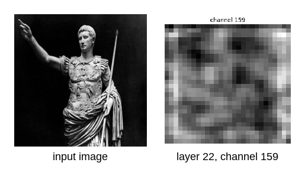

# Visualizing CNN Feature Maps

<p align="center">
  
  
  
  
</p>

A small notebook that hooks into a pretrained [VGG19](https://arxiv.org/abs/1409.1556) and looks at what its intermediate layers actually produce when given an image — turning the usual "image in, prediction out" black box inside out.

Feeding it a photo of a statue and inspecting layer 22 (a deep convolutional layer with 512 channels), **channel 159 lights up the most** — responding to the broad light/dark contrast structure of the figure.

<p align="center">
  
</p>

## Contents

- [Overview](#overview)
- [How it works](#how-it-works)
- [Results](#results)
- [What I learned](#what-i-learned)
- [Running it yourself](#running-it-yourself)
- [Why VGG19](#why-vgg19)
- [Project structure](#project-structure)
- [License](#license)

## Overview

CNNs are usually treated as black boxes — image in, prediction out. This project pokes at the middle of that box: it grabs the raw output tensors of a few `VGG19` layers using PyTorch forward hooks, and renders them as images so you can see what early vs. late layers are responding to.

It's a learning exercise, not a tool or library.

The pipeline:

1. **Model** — load a pretrained `torchvision.models.vgg19` in evaluation mode.
2. **Hooks** — attach forward hooks to four layers in `model.features`, two early and two late, and record their output tensors during a forward pass.
3. **Image** — load a real photo, resize and normalize it to the ImageNet/VGG19 standard.
4. **Visualize** — pick a single channel from a captured feature map and plot it as a grayscale image; then search all 512 channels of that layer for the one with the highest total activation.

## How it works

A **forward hook** is a function PyTorch calls every time a layer finishes its forward pass, with access to that layer's input and output — without changing the layer's behavior at all. It's a listening device, not a modification.

```python
feature_maps = {}

def make_hook(name):
    def hook(module, input, output):
        feature_maps[name] = output
    return hook

model.features[3].register_forward_hook(make_hook('layer 3'))
model.features[4].register_forward_hook(make_hook('layer 4'))
model.features[21].register_forward_hook(make_hook('layer 21'))
model.features[22].register_forward_hook(make_hook('layer 22'))
```

`model.features` is VGG19's stack of convolution, ReLU, and pooling layers — 36 of them in total, since ReLU and pooling each count as their own layer. Four were chosen to compare two stages of the network:

| Layer | Type | Depth | Output shape `(N, C, H, W)` |
|-------|------|-------|------------------------------|
| `features[3]`  | early | low-level features (edges, color blobs) | `[1, 64, 224, 224]` |
| `features[4]`  | early | low-level features, just pooled | `[1, 64, 112, 112]` |
| `features[21]` | deep  | high-level features (shapes, parts) | `[1, 512, 28, 28]` |
| `features[22]` | deep  | high-level features, just activated | `[1, 512, 28, 28]` |

The pattern across the network is clear: spatial resolution (`H × W`) shrinks at every pooling step, while the number of channels (`C`) grows — from 64 in the early layers to 512 by layer 22. Early layers keep a large, detailed grid but describe each pixel with relatively few numbers; deep layers compress the spatial grid down to a coarse 28×28, but describe each location with 512 learned features.

## Results

The input image is resized to 224×224 (the size VGG19 was trained on) and normalized with ImageNet's mean and standard deviation before the forward pass:

```python
mean = [0.485, 0.456, 0.406]
std  = [0.229, 0.224, 0.225]

transform = transforms.Compose([
    transforms.Resize((224, 224)),
    transforms.ToTensor(),
    transforms.Normalize(mean, std)
])
```

`layer 22`'s output is a `[1, 512, 28, 28]` tensor — 512 independent 28×28 grayscale "images," one per channel. Summing each channel's activations over height and width and taking the `argmax` finds the channel that responded most strongly to this particular image:

```python
activations = layer.sum(dim=(1, 2))  # total activation per channel
most_active = activations.argmax().item()
# → channel 159
```

| | |
|---|---|
| Layer inspected | `features[22]` (deep, 512 channels) |
| Feature map shape | `28 × 28` per channel |
| **Most active channel** | **159** of 512 |

Most other channels in this layer are largely flat or dark for this image — channel 159 stands out as the one that picked up the most signal from the statue's silhouette and folds.

## What I learned

The core idea that clicked here is that a CNN's "features" aren't a metaphor — they're literal tensors you can pull out mid-flight with a hook, reshape, and look at like any other image. Doing that for real made a few things concrete:

- **Hooks are observation, not interference.** Registering a forward hook doesn't change a single weight or output — it's a side channel for inspecting activations as they flow through the network.
- **Resolution trades for depth.** Going from `features[3]` to `features[22]`, spatial size drops from `224×224` to `28×28` while channel count rises from 64 to 512. The network is trading "where" for "what."
- **Not all channels are equal.** Out of 512 channels in a single layer, most produce near-zero activation for a given image — only a handful (here, channel 159) carry a strong signal. A feature map isn't one picture; it's hundreds of specialized detectors, almost all dormant at once.
- **Preprocessing matters.** Feeding VGG19 anything other than 224×224, ImageNet-normalized input doesn't just lower accuracy — the activations themselves stop reflecting anything meaningful, because the network has only ever seen inputs in that distribution.

## Running it yourself

The whole project lives in a single notebook, [`main.ipynb`](main.ipynb).

```bash
git clone https://github.com/nikitakuzmin06/visualize-cnn-feature-maps.git
cd visualize-cnn-feature-maps
pip install torch torchvision pillow matplotlib jupyter
jupyter notebook main.ipynb
```

Running the notebook downloads VGG19's pretrained weights automatically on first run, then walks through registering the hooks, running a forward pass, and plotting feature maps from `augustus.jpeg` (the bundled sample image) — each step annotated with notes on *why* it works the way it does, not just *what* it does.

> **Note:** to try this on your own image, just swap out `augustus.jpeg` for any other photo — the rest of the pipeline works unchanged.

## Why VGG19

VGG19 was picked because it's old enough to be simple: it's just a long, uniform stack of `3×3` convolutions, ReLUs, and max-pools — no skip connections, branches, or attention to reason about. That makes it an ideal subject for a first look at "what's inside a CNN," since every layer does one obvious thing and the network's structure is fully visible in `model.features`.

## Project structure

```
.
├── main.ipynb       # hooks, forward pass, feature map visualization — the whole project
├── augustus.jpeg    # sample input image
├── assets/          # images used in this README
│   ├── input.jpg
│   ├── channel-159.png
│   └── feature-map-comparison.png
├── LICENSE
└── README.md
```

## License

Released under the [MIT License](LICENSE).
